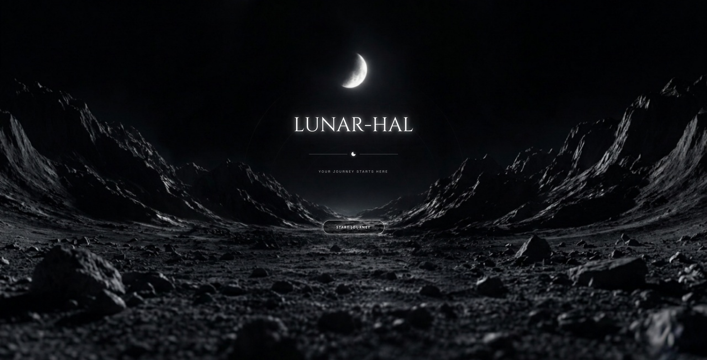

<div align="center">

# 🪐 LUNAR-HAL

### *An Infinite, AI-Driven Space Sandbox & Survival Engine Built in Rust*

[](https://www.rust-lang.org)
[](https://dioxuslabs.com)
[](#-the-broketech-manifesto)
[](https://www.gnu.org/licenses/agpl-3.0.html)

<br>



<br>
<br>

**Forget pre-baked skyboxes.** Lunar-HAL is a next-gen procedural universe simulator where every single star, planet, ecosystem, and creature is dreamed up in real-time by local artificial intelligence. 

[Explore Vision](#-core-features) • [Tech Stack](#%EF%B8%8F-architecture--tech-stack) • [Installation](#-quick-start)

---

</div>

## 🌌 The "Broke-Tech" Manifesto

> [!WARNING]
> ### READ BEFORE FLIGHT
> We don't have massive server farms or VC funding to burn on cloud API keys. We are proudly running everything **locally on your own machine**. Your high-end GPU is going to put in *work*, but in return, you get total data privacy, zero latency, and an infinite cosmos fueled entirely by your own electricity.

---

## 🎬 Gameplay Showcase

> [!NOTE]
> ### Preview Coming Soon
> Gameplay trailer and real-time canvas recording coming soon as we clear the local compiler warnings.

---

## 🚀 Core Features

| Feature | Dynamic Tech | Experience |
| :--- | :--- | :--- |
| **Infinite Cosmos** | Real-time LLM Generation | Fly through a limitless web of stars generated on the fly. Shift them, rearrange them, or let the AI shape the constellations. |
| **Planetary Descent** | Seamless Flight Physics | Double-click any star to watch a physical rocket launch and breach the atmosphere of a newly synthesized planet. |
| **Evolving Bio-Spheres** | Secondary Neural Pipeline | As you breach orbit, a specialized local vision/diffusion model crafts completely unique, physically accurate flora and fauna. |
| **True Hardcore Survival** | Uncompromising Physical Laws | No scripts. No faked gravity. Survive on uncharted worlds using actual telemetry, raw resource management, and your wits. |

---

## 🛠️ Architecture & Tech Stack

Lunar-HAL is built from scratch for maximum efficiency, safety, and modern looks:

* **Core Engine:** Pure, unadulterated **Rust** for bare-metal performance and zero-cost abstractions.
* **User Interface:** **Dioxus** with a futuristic glassmorphic Tailwind CSS layer for that premium desktop-and-web sleekness.
* **Local AI Pipeline:** ONNX Runtime / `candle` integrations to slice through neural model weights directly on your VRAM.
* **Physics:** Custom deterministically generated rigid-body systems.
---

## ⚡ Quick Start

### Prerequisites
Make sure your system has a proper GPU driver stack setup (CUDA/Vulkan) since the neural generation runs strictly on local hardware.
Also, ensure you have Rust and [Dioxus prerequisites installed](https://dioxuslabs.com/learn/0.7/getting_started/).

### Installation
#### GitHub Releases
1. Head to the [Releases](https://github.com/ininids/lunar-hal/releases) page and download the latest release.
2. Run the executable and enjoy!

#### From Source

```bash
# Clone the repository
git clone https://github.com/ininids/lunar-hal.git
cd lunar-hal

# Use the provided install script for installing and building the project
./install.sh
```