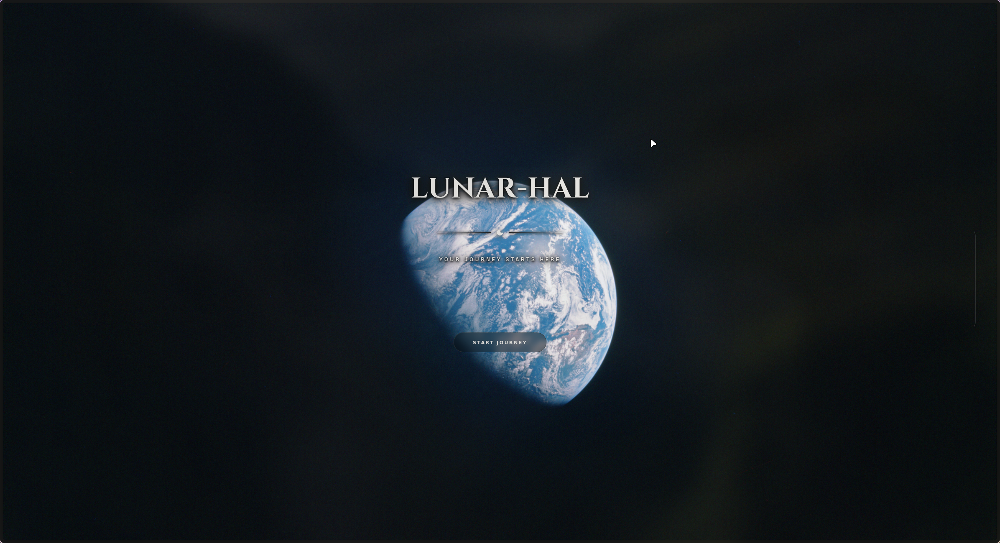

<div align="center">

# LUNAR-HAL

### Technical platform for generating, exploring, visualizing, and cataloguing stars

[![Badge Workflow]][Workflow]
[![Badge License]][License]
![Badge Language]

<br/>



</div>

## Overview

Lunar-HAL lets you explore new stars generated by neural networks in real time. Fly through space, inspect star systems, discover unique names, predict their physical properties visually, and so much more.

## Main Crates

The workspace is split into three parts: ai, main, and testbench. AI covers the neural networks and their CLI, main provides the core foundation with the frontend viewer, backend for inference and worlds, and shared UI components, while testbench includes everything related to the Lunar-HAL testbench for in-depth neural network workflows.


## Quick Start Guide

### 1. Clone the Repository

```bash
git clone https://github.com/INiNiDS/lunar-hal.git
cd lunar-hal
```

### 2. Automated Setup

Run the installation script to verify your toolchain, initialize directories, and compile core binaries in release mode:

**Linux / macOS:**
```bash
./install.sh
```

**Windows (PowerShell):**
```powershell
.\install.ps1
```

### 3. Managed Multi-Service Launch

Launch the interactive WebOS diagnostic and runtime suite:

```bash
cargo run --release -p lunar-start
```

This starts:
- **WebOS Testbench Desktop:** `http://127.0.0.1:16180`
- **Service Management API:** `http://127.0.0.1:16181`

From within the WebOS desktop (`:16180`), you can launch, monitor, inspect, and configure the Backend (`:25255`), Testbench Backend (`:25256`), and Frontend (`:8080`) directly from the dock.

### 4. Individual Service Execution

To run services individually in dedicated terminals:

```bash
# Terminal 1: Run AI & Scene Backend (Port 25255)
cargo run --release -p lunar-backend

# Terminal 2: Run Dioxus Web Frontend (Default: Port 8080)
cd crates/lunar-frontend
dx serve --platform web
# Note: If port 8080 is occupied by another local service (e.g. SearXNG), run with:
# dx serve --platform web --port 8088

# Terminal 3 (Optional): Run WebOS Testbench directly (Port 16180)
cd testbench/lunar-testbench
npm run build:css
cargo run --release -p lunar-testbench --bin lunar-testbench
```
## How to use lunar-frontend

Just head over to the port or URL—you'll see a header image and a button. Hit the button, tweak your settings, and jump in. The site will automatically go fullscreen and prompt you to either create a new world or join an existing one. If it's your first time, click 'Create', set your world center coordinates and entropy, and hit 'Start'. Wait a second for it to generate, and your world opens up. Fly around, check out the planets, and click on them to see their details.

## WebOS and documentation

lunar-testbench is a WebOS-style utility designed for testing and training neural nets, handling frontend and backend workflows, and running services. Basically, it's an all-in-one app that gives you deep, granular control over everything without ever needing to touch the CLI.

- [Architecture](docs/architecture.md)
- [HTTP API](docs/api.md)
- [Frontend platforms](docs/frontend-platforms.md)
- [Gallery storage](docs/gallery-storage.md)
- [WebOS lifecycle](docs/webos-lifecycle.md)
- [Testing matrix](docs/testing.md)
- [lnai-data pipeline (Stage 4)](docs/lnai-data-stage4.md)
- [NASA/Stardance data (Stage 4A)](docs/nasa-stardance-data.md)

## Dataset

The dataset is primarily built from Gaia DR3 (we will update to DR4 when it releases) with custom download settings, supplemented by other smaller datasets that make up less than 2% of the total. However, you can train the neural network yourself to change this ratio or train it entirely on your own internal datasets.

## Development checks

```bash
cargo fmt --all -- --check
cargo check -p lunar-utils -p lunar-structures -p lunar-stellar-core -p lunar-backend -p lunar-start -p lunar-start-backend
cargo test -p lunar-stellar-core -p lunar-start -p lunar-start-backend
cd testbench/lunar-testbench
npm ci
npm run build:css
cargo test -p lunar-testbench --bin lunar-testbench
```

# Disclaimer

AI folder IS NOT AI Generated Code. It is a collection of neural network models and their training scripts, which are written by me. I've just spent 4 months on it. 

## Image 

Image sourced from the Apollo 15 project on Flickr.

<!-- Badge References -->
[Badge Workflow]: https://img.shields.io/github/actions/workflow/status/INiNiDS/lunar-hal/ci.yml?branch=main&style=for-the-badge&logo=githubactions&logoColor=white
[Workflow]: https://github.com/INiNiDS/lunar-hal/actions

[Badge License]: https://img.shields.io/github/license/INiNiDS/lunar-hal?style=for-the-badge&color=blue
[License]: LICENSE

[Badge Language]: https://img.shields.io/badge/Language-Rust-ea4a31?style=for-the-badge&logo=rust&logoColor=white

[Badge Dioxus]: https://img.shields.io/badge/Frontend-Dioxus-000000?style=for-the-badge&logo=rust&logoColor=5fcbf2
[Dioxus]: https://dioxuslabs.com

[Badge Issues]: https://img.shields.io/github/issues/INiNiDS/lunar-hal?style=for-the-badge&color=yellow
[Issues]: https://github.com/INiNiDS/lunar-hal/issues

[Badge Pull Requests]: https://img.shields.io/github/issues-pr/INiNiDS/lunar-hal?style=for-the-badge&color=blueviolet
[Pull Requests]: https://github.com/INiNiDS/lunar-hal/pulls