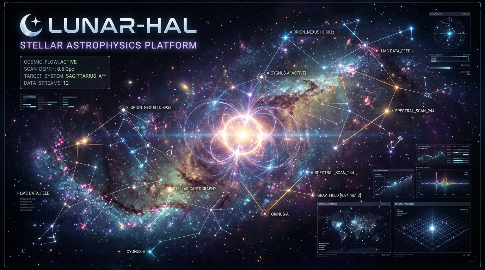
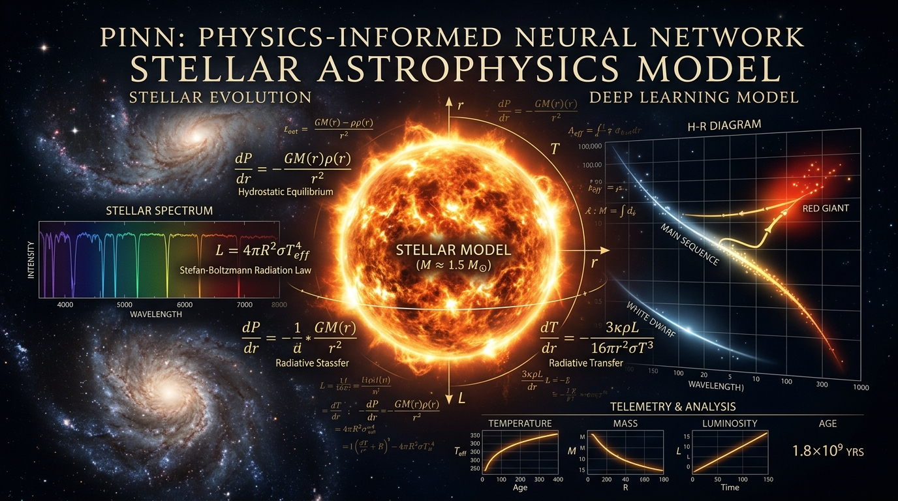
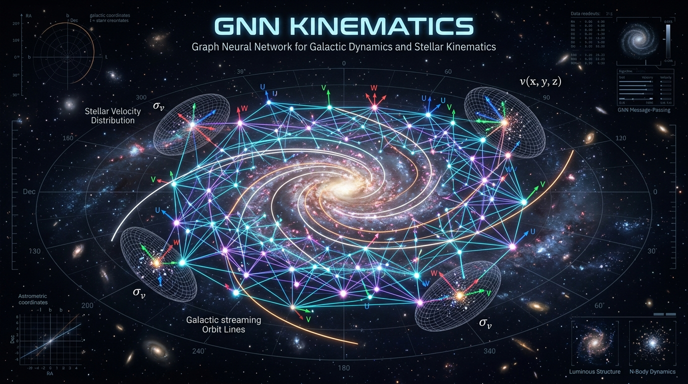
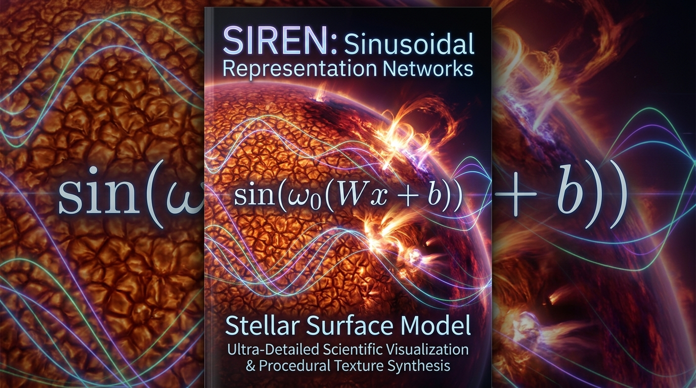

<div align="center">

# ✦ LUNAR-HAL

### Next-Generation Technical Platform for Generating, Exploring, Visualizing, and Cataloguing Stars

[](https://www.rust-lang.org)
[](https://dioxuslabs.com)
[](https://burn.dev)
[](https://www.cosmos.esa.int/web/gaia/dr3)
[](LICENSE)

<br/>



</div>

---

## 🌌 Overview

**Lunar-HAL** is a local-first stellar laboratory and real-time astronomical exploration platform. It unifies high-throughput scientific datasets (**ESA Gaia DR3** TAP, **NASA Exoplanet Archive** IPAC/Caltech) with an advanced suite of local deep learning models powered by **[Burn](https://burn.dev)**:
- **PINN:** Physics-Informed Neural Network predicting stellar parameters subject to Stefan-Boltzmann physical constraints.
- **GNN Kinematics:** Graph Neural Network modeling 3D stellar velocities ($U, V, W$), dispersion ellipsoids, and galactic drift.
- **SIREN:** Sinusoidal Representation Networks synthesizing continuous, infinite-resolution procedural star photospheres and chromatic limb darkening.
- **GNN Localization:** Graph message passing for missing-neighbor spatial infilling and astrometric cluster reconstruction.

All visual exploration is delivered through an interactive multi-platform star map (Web, Desktop, and Android via **Dioxus**) and an integrated floating-window WebOS testbench (**`lunar-testbench`**).

---

## 🧠 Neural Architecture Suite

Detailed model documentation, specifications, and weight checksums can be found in **[`models/README.md`](models/README.md)**.

| Model | Architecture | Primary Task | Key Physical Principles |
| :--- | :--- | :--- | :--- |
| **[PINN](models/README.md#1-physics-informed-neural-network-pinn)** | `pinn-v1` | Stellar parameter estimation ($\log T_{\text{eff}}, \log R, \log M, \log L$) | Stefan-Boltzmann law $L = 4\pi R^2 \sigma T^4$ and hydrostatic equilibrium |
| **[GNN Kinematics](models/README.md#2-graph-neural-network-for-kinematics-gnn)** | `gnn-kinematics-v1` | 3D velocity vectors ($v_x, v_y, v_z$) & uncertainty heads | Sparse $k$-NN message passing, galactic dynamics, orbital drift |
| **[SIREN](models/README.md#3-sinusoidal-representation-networks-siren)** | `siren-v1` | Continuous procedural stellar surface textures | Periodic activation $\sin(\omega_0(Wx+b))$, multi-spectral irradiance |
| **[GNN Localization](models/README.md#4-gnn-localization--astrometric-infilling-experimental)** | `gnn-localization-v1` | Masked astrometric recovery in dense clusters | Spatial Delaunay & nearest-neighbor coordinate infilling |

<div align="center">
  <table width="100%">
    <tr>
      <td width="33%" align="center">
        <br/>
        <b>PINN Astrophysics</b>
      </td>
      <td width="33%" align="center">
        <br/>
        <b>GNN Kinematics</b>
      </td>
      <td width="33%" align="center">
        <br/>
        <b>SIREN Photosphere</b>
      </td>
    </tr>
  </table>
</div>

---

## 🏗 System Architecture

```
                                    ┌───────────────────────┐
                                    │    lunar-start-cli    │
                                    │   (Orchestrator)      │
                                    └───────────┬───────────┘
                                                │
                 ┌──────────────────────────────┼──────────────────────────────┐
                 ▼                              ▼                              ▼
    ┌─────────────────────────┐    ┌─────────────────────────┐    ┌─────────────────────────┐
    │     lunar-backend       │    │     lunar-frontend      │    │     lunar-testbench     │
    │  Authorized AI Inference│    │ Multi-platform Star Map │    │   Floating WebOS Suite  │
    │  Authoritative Scenes   │    │  (Web, Desktop, Android)│    │  (Diagnostics & SandBox)│
    └────────────┬────────────┘    └────────────┬────────────┘    └────────────┬────────────┘
                 │                              │                              │
                 └──────────────────────────────┼──────────────────────────────┘
                                                ▼
                                   ┌─────────────────────────┐
                                   │    lunar-stellar-core   │
                                   │ Shared Client, Camera,  │
                                   │ Validation & Cache      │
                                   └────────────┬────────────┘
                                                ▼
                                   ┌─────────────────────────┐
                                   │       ai/lnai-*         │
                                   │ Data, Training, Models  │
                                   │   (Burn AI Framework)   │
                                   └─────────────────────────┘
```

### Workspace Member Crates

- **`crates/lunar-stellar-core`** — Framework-agnostic stellar scene client: camera mathematics, coordinate validation, spatial hash caching, sector streaming, and REST API client.
- **`crates/lunar-backend`** — High-performance Axum server executing Burn neural inference, sector generation, authoritative star scenes, and gallery persistence.
- **`crates/lunar-frontend`** — Cross-platform Dioxus client rendering the interactive star map with pan/zoom, sector streaming, and star inspector panels.
- **`crates/lunar-start` / `lunar-start-backend`** — Managed service launcher: handles process lifecycles, configuration validation, log multiplexing, and HTTP readiness probes.
- **`crates/lunar-structures`** — Shared serialization domain models, geometric primitives, and API contracts.
- **`crates/lunar-utils`** — Environment configuration helpers, network port resolution, and common utilities.
- **`testbench/lunar-testbench`** — Floating-window WebOS running interactive diagnostic tools, model benchmarking, dataset inspection, and live embedded frontend sandbox.
- **`ai/lnai-data`** — Real astronomical data ingestion engine for ESA Gaia DR3 TAP, NASA Exoplanet Archive, parquet conversion, and spatial partitioning.
- **`ai/lnai-models`** — Core neural architectures (PINN, GNN, SIREN, Localization) implemented in Burn.
- **`ai/lnai-training`** — Training pipelines, physics loss functions, regression evaluators, and atomic artifact publishing.
- **`ai/lunar-ai-cli` (`lnaicli`)** — Command-line interface for data collection, cleaning, splitting, training, and artifact integrity hashing.

---

## 🚀 Quick Start Guide

### 1. Clone the Repository

```bash
git clone https://github.com/INiNiDS/lunar-hal.git
cd lunar-hal
```

### 2. Automated Setup

Run the installation script to verify your toolchain and initialize workspace dependencies:

```bash
chmod +x install.sh
./install.sh
```

### 3. Managed Multi-Service Launch

Launch all services simultaneously with unified logs and automatic health-checking:

```bash
cargo run -p lunar-start
```

This starts:
- **Backend API:** `http://127.0.0.1:25255`
- **Web Frontend:** `http://127.0.0.1:8080`
- **Management API:** `http://127.0.0.1:16181`

### 4. Individual Service Execution

To run services individually in dedicated terminals:

```bash
# Terminal 1: Run AI & Scene Backend
cargo run -p lunar-backend

# Terminal 2: Run Dioxus Web Frontend
cd crates/lunar-frontend
dx serve --platform web

# Terminal 3 (Optional): Run WebOS Testbench
cd testbench/lunar-testbench
npm run build:css
cargo run -p lunar-testbench --bin lunar-testbench
```

---

## 🛠 AI Pipeline & CLI (`lnaicli`)

Collect canonical Gaia astrometry and execute the end-to-end training pipeline:

```bash
# Ingest 100,000 stars from ESA Gaia DR3 TAP endpoint
cargo run --release -p lunar-ai-cli -- fetch \
  --max-rows 100000 \
  --output ai_data/raw_stars.csv

# Clean, normalize and convert to high-performance Parquet format
cargo run --release -p lunar-ai-cli -- clean \
  --input ai_data/raw_stars.csv \
  --output ai_data/clean_stars.parquet

# Train PINN model with Stefan-Boltzmann physics constraints
cargo run --release -p lnai -- \
  --data ai_data/clean_stars.parquet \
  --epochs 100 \
  --val-frac 0.1
```

Or run the automated multi-stage pipeline script:
```bash
./run_pipeline.sh
```

---

## 🧪 Testing & Quality Assurance

Run the comprehensive workspace validation suite:

```bash
# Code formatting check
cargo fmt --all -- --check

# Full workspace compilation check
cargo check --workspace

# Unit and integration test suites
cargo test -p lunar-structures -p lunar-utils -p lunar-stellar-core -p lunar-start -p lunar-start-backend
cargo test -p lunar-backend
cargo test -p lnai-models --all-features
cargo test -p lnai-data

# Testbench WebOS test suite
cargo test -p lunar-testbench --bin lunar-testbench
```

---

## 📚 Technical Documentation

- [Neural Model Registry & Artifacts Specification](models/README.md)
- [System Architecture](docs/architecture.md)
- [HTTP API Reference](docs/api.md)
- [AI Artifact Contracts & Registry](docs/ai-artifacts.md)
- [AI Benchmarks & Parity Verification](docs/ai-benchmarks.md)
- [Frontend Platforms](docs/frontend-platforms.md)
- [Gallery Storage](docs/gallery-storage.md)
- [WebOS Lifecycle](docs/webos-lifecycle.md)
- [NASA / Stardance Data Enrichment](docs/nasa-stardance-data.md)

---

## 🔭 Acknowledgements & Data Provenance

- **ESA Gaia DR3:** Astrometry and photometry acquired from the European Space Agency (ESA) mission Gaia, processed by the Gaia Data Processing and Analysis Consortium (DPAC).
- **NASA Exoplanet Archive:** Stellar and planetary parameters enriched via the NASA Exoplanet Science Institute (IPAC) / California Institute of Technology.
- **Burn:** Accelerated deep learning library for Rust developed by Tracel AI.

---

<div align="center">
  <sub>Built with 🦀 Rust & 🌌 Cosmic Precision by Nikita Goncharov</sub>
</div>

