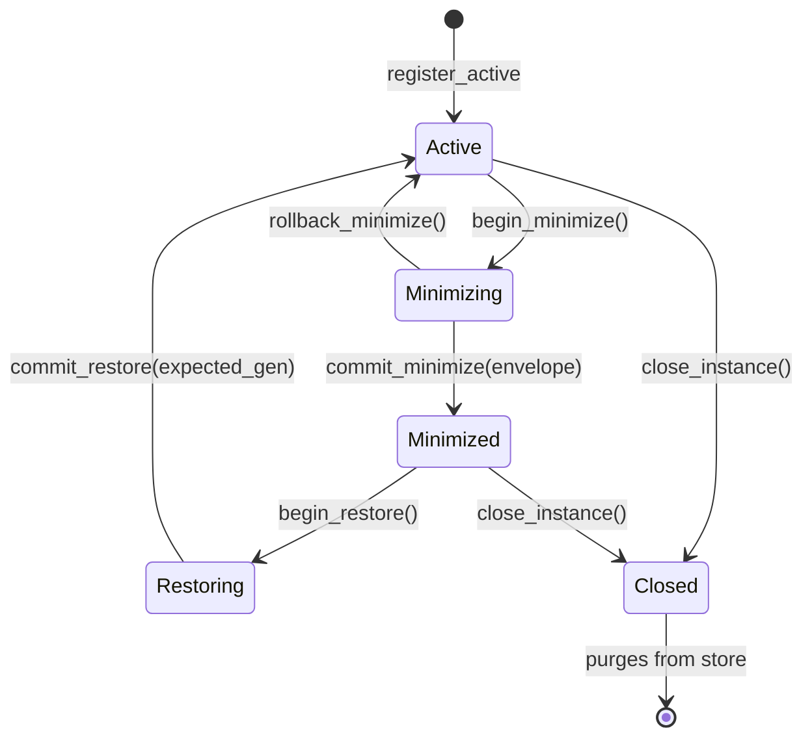

# Lunar-OS RAM Snapshot & Window Lifecycle Architecture

## Overview
This document specifies the authoritative runtime lifecycle architecture for windowed applications within the Lunar-OS desktop environment (`testbench/lunar-testbench/src/os/ram.rs`, `snapshot.rs`, `state.rs`).

Prior implementations preserved minimized windows by keeping their DOM tree mounted with `display: none` and `visibility: hidden`. In production environments with heavy WebGL canvas contexts, WebGPU pipelines, and live Server-Sent Events (SSE / EventSource), this legacy approach led to browser context thrashing, GPU memory exhaustion, and memory leaks.

Lunar-OS replaces the hidden-DOM model with the **RAM Snapshot Architecture**: windows undergoing minimization serialize their state into a versioned, integrity-checked payload envelope, unmount completely from the DOM, and re-hydrate upon restore.

---

## 1. Lifecycle State Machine
Each window instance is tracked in `LunarOsRamStore` as an isolated entry transitioning through five discrete states:



### State Definitions
1. **`Active`**: Window is mounted, visible, and fully interactive. Render loops, event listeners, and SSE connections are running.
2. **`Minimizing`**: Window has begun minimization. Rendering is frozen; the application is requested to serialize its state.
3. **`Minimized`**: Window is completely unmounted from the DOM. Its state resides safely in `LunarOsRamStore` as an `AppSnapshotEnvelopeV1`. Zero GPU textures, canvases, or SSE connections remain active.
4. **`Restoring`**: Restore request initiated. The window container is remounted, claiming the current snapshot generation.
5. **`Closed`**: Window is permanently terminated. All snapshot envelopes and registration records are deleted from RAM.

---

## 2. Two-Phase Minimize Commit Protocol

To prevent corrupted states or silent data loss, minimization operates as a transactional two-phase commit:

### Phase 1: `begin_minimize(instance_id)`
- Verifies that the instance is currently in `Active` state.
- Transitions instance state to `Minimizing`.
- Signals the window iframe or internal component to prepare for suspend.

### Phase 2: State Serialization & Integrity Check
The application serializes its working context into an `AppSnapshotEnvelopeV1`:
```rust
pub struct AppSnapshotEnvelopeV1 {
    pub version: u32,                  // Currently 1
    pub instance_id: String,
    pub app_id: String,
    pub window_geometry: WindowGeometry,
    pub captured_at_ms: u64,
    pub checksum_crc32: u32,           // IEEE 802.3 CRC32 of payload
    pub payload: serde_json::Value,
}
```
- IEEE 802.3 CRC32 is calculated over the serialized payload string.
- If serialization fails, `rollback_minimize(instance_id)` returns the window directly to `Active` without data loss.

### Phase 3: `commit_minimize(instance_id, envelope)`
- Verifies `Minimizing` state.
- Executes `envelope.verify_integrity()`, checking schema version and CRC32 parity.
- Increments `restore_generation += 1`.
- Commits envelope to the store and transitions state to `Minimized`.
- Shell unmounts the window DOM tree.

---

## 3. Two-Phase Restore Hydration Protocol

Restoring a minimized window guarantees freshness and guards against race conditions (e.g., duplicate restore clicks or stale transactions):

### Phase 1: `begin_restore(instance_id) -> Result<u64, String>`
- Verifies `Minimized` state.
- Transitions instance state to `Restoring`.
- Claims and returns the current `restore_generation`.

### Phase 2: Shell Mount & Envelope Consumption
- The shell remounts the window DOM tree with saved `WindowGeometry` coordinates.
- Calls `commit_restore(instance_id, expected_generation)`:
  - Asserts that `expected_generation == entry.restore_generation`. Rejects with `StaleGeneration` error if mismatched.
  - Takes (`take()`) the snapshot envelope out of RAM, verifying payload CRC32 again.
  - Transitions instance state to `Active`.
- Injects the restored `payload` into the application component to hydrate form values, scroll positions, camera offsets, and history.

---

## 4. Sandbox WebGL & EventSource Handshake

Specialized handling is required for apps hosting WebGL contexts (e.g. `sandbox.rs` Stellar Scene viewer) or live network streams:

### WebGL Context Lifecycle
- **On Minimize:**
  1. Window triggers `post_iframe_prepare_suspend`.
  2. Rendering animation loop (`requestAnimationFrame`) is canceled.
  3. Dynamic WebGL textures, VBOs, and shaders are deallocated.
  4. Canvas element is removed from DOM when the subtree unmounts.
- **On Restore:**
  1. Canvas element is newly mounted.
  2. WebGL2 context is initialized afresh.
  3. Camera zoom, offset, and selected star IDs are restored from `payload`.
  4. Textures and geometry buffers are regenerated from sector cache.

### EventSource (SSE) Streams
- **On Minimize:**
  1. Active `EventSource` / SSE connections are explicitly closed (`.close()`).
  2. Last received event ID / timestamp is recorded into the snapshot payload.
- **On Restore:**
  1. Connection is re-established with `Last-Event-ID` header.
  2. Missed events are replayed or state is reconciled from backend.

---

## 5. Multi-Instance Isolation & Zero-Leak Durability

- **Instance Independence:** Each open window possesses a globally unique `instance_id` (e.g., `win-1`, `win-2`). Multiple instances of the same application (e.g., two terminal windows or two log viewers) maintain completely disjoint snapshots and independent monotonic generation counters.
- **50-Cycle Durability Verification:** Validated by `fifty_cycle_ram_minimize_restore_leak_test` and `multi_instance_isolation_50_cycles_test` in `testbench/lunar-testbench/src/os/ram.rs`:
  - 50 consecutive minimize/restore iterations increment `restore_generation` from 1 to 50 with 100% CRC32 integrity.
  - Interleaved operations across 5 concurrent applications produce zero cross-talk or generation collisions.
  - Calling `close_instance(instance_id)` purges all record entries from `LunarOsRamStore`, returning heap and store allocations to zero.
